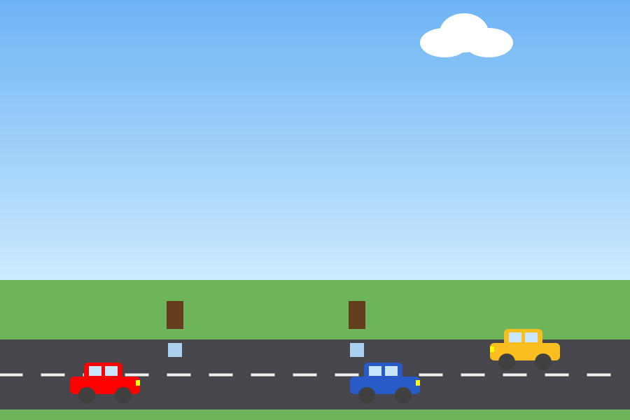
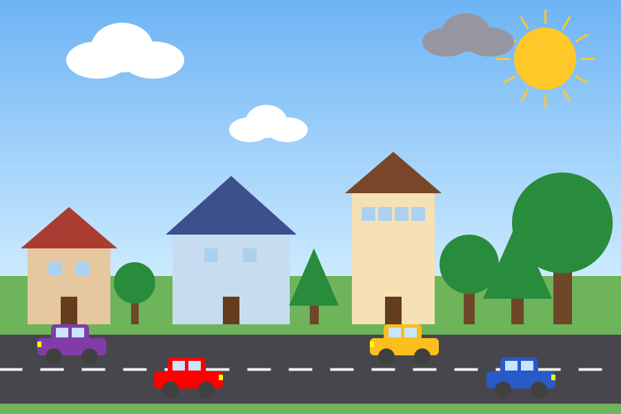

# Mahalle Laboratuvarı — Boşlukları Doldur, Mahalleyi Canlandır

Bu etkinlikte hazır bir Java projesinin sınıflarındaki **boşlukları** dolduracaksınız. Her boşluğu doğru doldurduğunuzda ekranda bir şey değişecek: evler belirecek, arabalar hareket edecek, güneş doğacak.

| Başlangıçta | Bütün boşluklar dolunca |
| --- | --- |
|  |  |

---

## Kurallar

- **Yapay zekâ araçları kullanılmaz.** Takılırsanız dosyadaki ipuçlarını okuyun, grup arkadaşınıza ya da öğretmeninize sorun.
- Her boşluğun hemen üstünde ne yazmanız gerektiğini anlatan bir ipucu var.
- `BOŞLUK` yazmayan satırları değiştirmenize gerek yok, ama okuyup anlamaya çalışın.

---

## Nasıl çalıştırılır?

**IDE ile (VS Code, IntelliJ, NetBeans, Eclipse):** `src` klasöründeki **`Main.java`** dosyasını açın ve çalıştırın. Başka bir dosyayı çalıştırırsanız “Main method not found” hatası alırsınız.

**Terminalle:**

```
cd src
javac -encoding UTF-8 *.java
java Main
```

Her boşluğu doldurduktan sonra programı **kapatıp yeniden çalıştırın** ve neyin değiştiğine bakın.

---

## Görev dağılımı

Her grup üyesi bir dosya alır. Boşluklar birbirinden bağımsızdır; herkes aynı anda çalışabilir.

| Dosya | Boşluk sayısı |
| --- | --- |
| `Ev.java` | 5 |
| `Agac.java` | 5 |
| `Araba.java` | 4 |
| `Bulut.java` | 3 |
| `Gunes.java` | 3 |
| `Sahne.java` | 2 (grubun kendi arabası ve bulutu, hep birlikte) |

3–4 kişilik gruplarda Bulut ile Güneş'i aynı kişi alabilir.

Dosyada boşlukları bulmak için **Cmd + F** (Windows'ta Ctrl + F) ile `BOŞLUK` kelimesini arayın.

---

## Doğru yaptım mı? Ekrana bakın

| Dosya | Boşluk | Doğruysa ekranda ne olur? |
| --- | --- | --- |
| Ev | 1 | Ortadaki ve sağdaki ev görünür. |
| Ev | 2 ve 5 | Terminalde `Ev: 3` yazar (önceden `Ev: 0`). |
| Ev | 3 | Soldaki kırmızı çatılı ev de görünür. |
| Ev | 4 | Sağdaki uzun evde 6 değil, 4 pencere olur. |
| Ağaç | 1 | Ağaçlar görünür. Sağdaki ağaç dev gibi olur (Boşluk 3'te düzelecek). |
| Ağaç | 2 | Çimene tıklayınca yeni ağaç çıkar. |
| Ağaç | 3 | Sağdaki dev ağaç ekrana sığacak boya iner. |
| Ağaç | 4 | **B** tuşuna basınca ağaçlar büyür. |
| Ağaç | 5 | Bazı ağaçlar üçgen (çam) olur. |
| Araba | 1 | Arabalar hareket etmeye başlar. |
| Araba | 2 | Terminalde `Araba: 4` yazar. |
| Araba | 3 | **Y** tuşuna basınca arabalar yön değiştirir. |
| Araba | 4 | Üst şeritteki sarı araba sola doğru gider. |
| Bulut | 1 | Sol üstteki beyaz bulut görünür. Gökyüzüne tıklayınca yeni bulut çıkar. |
| Bulut | 2 | Bulutlar sağa doğru kayar. |
| Bulut | 3 | Sağ üstteki bulut gri (yağmurlu) olur. |
| Güneş | 1 | Güneşin sarı dairesi görünür. |
| Güneş | 2 | **G** tuşuna basınca güneş aya döner. |
| Güneş | 3 | Güneşin ışınları görünür. |
| Sahne | S1, S2 | Sizin seçtiğiniz araba ve bulut sahnede görünür. |

**Denemeniz gereken tuşlar:** **G** gece/gündüz, **H** arabaları hızlandır, **Y** yön değiştir, **B** ağaçları büyüt. Çimene ya da gökyüzüne tıklayarak da nesne ekleyebilirsiniz.

---

## Bitirince

1. Bütün boşluklar dolu ve program hatasız çalışıyor olmalı.
2. **G** tuşuyla gece moduna geçin ve sahnenin ekran görüntüsünü alın.
3. Ekran görüntüsünü öğretmeninize gösterin ya da gönderin.

---

## Takıldım, ne yapayım?

- **Kırmızı altı çizili satır var:** Noktalı virgülü (`;`) ya da parantezleri unutmuş olabilirsiniz. Yazdığınız satırı ipucuyla karşılaştırın.
- **Ekranda hiçbir şey değişmedi:** Programı kapatıp yeniden çalıştırdınız mı? Dosyayı kaydettiniz mi?
- **`this.` ne demek?** Sınıfın kendi alanı demek. `this.genislik = genislik;` satırı “parametre olarak gelen genişliği bu evin genişliğine yaz” anlamına gelir.
